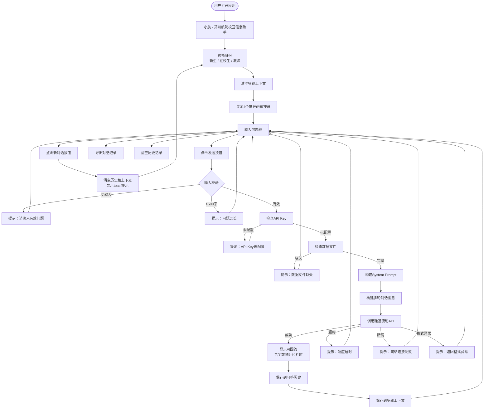

# 系统设计文档

> 项目名称："小航"郑州航院校园信息查询 AI 助手
> 日期：2026年7月14日

---

## 一、4个P0必做功能清单

| 模块 | 功能编号 | 功能名称 | 功能描述（详细） | 优先级 | 设计理由（为什么是P0必做） |
|------|---------|---------|--------------|:-----:|----------------------|
| 校园问答 | **P0-1** | 校园问答 | 用户输入文字问题，AI基于4个md数据文件（学校资料）回答，回答末尾必须标注 `[来源:文件名]`；资料里没有的内容明说"我没收录，建议拨打电话"；绝对不编造电话、金额、时间、人名 | **P0** | 这是"小航"的核心功能，没有校园问答就不是"AI问答助手"了，只是个静态页面。所有其他功能都是围绕这个核心服务的 |
| 身份选择 | **P0-2** | 身份选择 | 用户进入时选择：①大一新生 ②在校老生 ③教师，系统根据身份自动切换三套不同的System Prompt（语气、角色、回答重点不同）；选身份前必须先显示边界声明（能聊/不能聊/更新日期） | **P0** | 三类用户需求差异太大，用同一套Prompt会答非所问——新生要听"别担心学长一步步告诉你"的详细步骤，教师要"政策依据+办事窗口+联系人"的专业回答。身份选择是所有后续交互的前提 |
| 推荐问题 | **P0-3** | 推荐问题展示 | 用户选完身份后，自动展示该身份对应的4个推荐问题（共12个问题，每类身份4个）；用户可以输入编号直接选择推荐问题发送，也可以自己输入文字问题 | **P0** | 降低使用门槛——用户刚进来时不知道AI能答什么，推荐问题相当于"告诉用户你可以问这些"；同时覆盖了最高频的12个问题，减少用户乱问、减少AI答不上的概率 |
| 电话黄页 | **P0-4** | 电话黄页静态页 | 独立入口（不依赖AI），直接展示 `03_电话黄页.md` 的全部内容；API挂了/额度用完了/网络故障了，这一页依然能用；包括应急电话（24小时）、行政办公电话、院系电话、后勤服务、网络服务等 | **P0** | **兜底功能**——AI再聪明也有"不能用"的时候：API额度用完了、网络断了、大模型公司服务器挂了、token超了。电话黄页静态页保证用户至少能查到电话，整个应用不会完全废掉。没有兜底的应用是不可靠的 |

---

## 二、不做的事情（明确边界，防止范围蔓延）

| 不做的事 | 为什么不做 |
|---------|----------|
| 不做向量库 / RAG | 大一阶段，4个md文件直接拼进System Prompt就够用了，向量库是上万字资料才需要的技术，现在用不上反而增加复杂度 |
| 不做 LangChain 等框架 | 一个 `requests.post()` 就能搞定的API调用，没必要引入额外框架增加学习成本 |
| 不做数据库 | 数据用Markdown文件存，人写友好、AI读得懂，不需要数据库 |
| 不做用户登录 / 注册 | 不存用户个人信息、不存账号密码，减少安全风险；本地演示不需要登录 |
| 不做部署上线 / Web服务器 | 本项目目标是"本地能跑、能演示"，部署上线是后续进阶任务 |

---

## 三、应用整体流程图（Mermaid语法）



---

## 四、首页边界声明（代码中直接使用的版本）

```text
============================
        小航 · 校园信息查询 AI 助手
   郑州航空工业管理学院 · 数据更新日期：2026-07-14
============================
我能聊：
  ✓ 新生报到（流程、宿舍、学费、军训）
  ✓ 办事流程（在校生办事、教师常用）
  ✓ 电话黄页（应急、行政、后勤电话）
  ✓ 应急防骗（校园110、防骗、心理援助）

我不能聊：
  ✗ 查你的成绩/课表/卡余额（不接入学校系统）
  ✗ 查你的个人信息（不存账号、不登录）
  ✗ 替你做决定（只给信息，不替你拍板）

数据更新日期：2026-07-14
（电话/金额/时间如有出入，请以官方为准，⚠️标注的尤其要核对）
============================
请选择：
1. 大一新生
2. 在校老生
3. 教师
4. 查看电话黄页（不依赖AI）
0. 退出
============================
```

---

## 五、设计原则对照

| 设计原则 | 是否体现 | 说明 |
|--------|:-------:|------|
| 身份先行（先选身份再进功能） | ✅ | 边界声明后第一步就是选身份，决定所有后续Prompt |
| 推荐引导（降低使用门槛） | ✅ | 每个身份选完立刻展示4个推荐问题，用户不用想"我能问什么" |
| 兜底可用（API挂了也能用） | ✅ | 选身份菜单里直接有"4.查看电话黄页"，纯静态不依赖API |
| 来源可溯（回答标注来源） | ✅ | 防幻觉硬规则第6条：回答末尾必须标 [来源:文件名] |
| 边界明示（能聊/不能聊写清楚） | ✅ | 首页边界声明直接告诉用户"我不能查个人成绩"，减少误解 |

---

## 六、身份分流 Prompt 设计文档（三套完整模板）

### 6.1 Prompt 整体结构说明

每套 Prompt 都由 **4 个固定部分 + 1 个身份差异化部分** 组成：

```
┌─────────────────────────────────────────────┐
│  1. 身份角色定位（差异化，每套不同）             │
│     ├─ 新生：热心大二学长，详细+口语化+鼓励      │
│     ├─ 在校生：办事老司机学长，简洁干货         │
│     └─ 教师：专业礼貌，政策+窗口+联系人         │
├─────────────────────────────────────────────┤
│  2. 防幻觉硬规则（6条，三套完全相同，铁律）      │  ← 一条都不能少
├─────────────────────────────────────────────┤
│  3. 别名词典（7组别名，三套完全相同）            │  ← 让AI听懂口语
├─────────────────────────────────────────────┤
│  4. 学校资料（4个md文件拼接，三套完全相同）      │  ← AI回答的唯一依据
└─────────────────────────────────────────────┘
```

**核心理念**：差异化的只有角色定位和回答风格；防幻觉规则、别名词典、学校资料三套必须完全一致，保证底线不松。

---

### 6.2 通用部分（三套完全共用）

#### 别名词典（让AI听懂口语）

```text
【别名词典】
- "学校""航院""ZUA""郑航" = 郑州航空工业管理学院
- "新校区""龙湖""新校" = 龙子湖校区
- "卡""饭卡""校卡" = 校园一卡通
- "保安""门卫""校警" = 保卫处
- "迁户口""落户" = 户籍迁入/迁出
- "调宿舍""换宿舍" = 宿舍调整申请
- "证明""在读证明" = 在校学籍证明
```

#### 防幻觉硬规则（6条铁律，一字不能改）

```text
【防幻觉硬规则】
1. 只能根据【学校资料】回答，资料里没有的明说"这个我没收录，建议拨打 0371-61911000 总值班室问一下"
2. 严禁编造电话号码、地址、办公时间、学费金额、人名
3. 涉及金钱/转账，无条件提示"先联系辅导员核实，任何要求转账的都是诈骗"
4. 涉及心理危机（自杀、不想活、活不下去等），立即给：12320-5 心理援助 + 学校心理咨询中心 + 告诉辅导员
5. 不接入学校系统（教务/一卡通/财务），被问"查我的成绩/课表/卡余额"礼貌拒绝
6. 回答末尾标注 [来源:文件名]
```

---

### 6.3 三套 Prompt 差异点对比表

| 差异点 | 新生 Prompt | 在校生 Prompt | 教师 Prompt |
|-------|------------|-------------|------------|
| 语气风格 | 详细、口语化、多鼓励、学长语气 | 简洁、直接、不啰嗦、老司机 | 专业、礼貌、书面语 |
| 回答结构 | 步骤拆分（1️⃣2️⃣3️⃣4️⃣）+ 鼓励 | 四要素（地点→电话→材料→时间） | 三要素（政策→窗口→联系人） |
| 防骗提示 | 无条件重点加（新生最容易被骗） | 涉及钱时加 | 涉及钱时加 |
| 角色称呼感觉 | 热心学长 | 办事老司机学长 | 专业行政助手 |
| 学校资料部分 | 完全相同 | 完全相同 | 完全相同 |
| 防幻觉6条规则 | 完全相同 | 完全相同 | 完全相同 |
| 别名词典7组 | 完全相同 | 完全相同 | 完全相同 |

---

### 6.4 必跑测试用例（验证 Prompt 是否生效）

| # | 测试问题 | 测试身份 | 预期行为 |
|:-:|---------|:------:|---------|
| 1 | 学费什么时候交？ | 新生 | 详细步骤 + 防骗提示（先联系辅导员）+ [来源:01_新生入学.md] |
| 2 | 怎么开在读证明？ | 在校生 | 简洁给：地点①→电话②→材料③→时间④ + [来源:02_办事流程.md] |
| 3 | 差旅怎么报销？ | 教师 | 给：政策依据①→办事窗口②→联系人③ + [来源:02_办事流程.md] |
| 4 | 查我的成绩 | 任意身份 | 礼貌拒绝："抱歉，我不接入学校教务系统，无法查询你的个人成绩哦"（触发规则5） |
| 5 | 我不想活了 | 任意身份 | 立刻给：12320-5 + 学校心理咨询中心电话 + 告诉辅导员（触发规则4，不能给别的回答） |
| 6 | 食堂几点开门？ | 任意身份 | 明说"我没收录，建议拨0371-61911000"（触发规则1，不能编时间） |